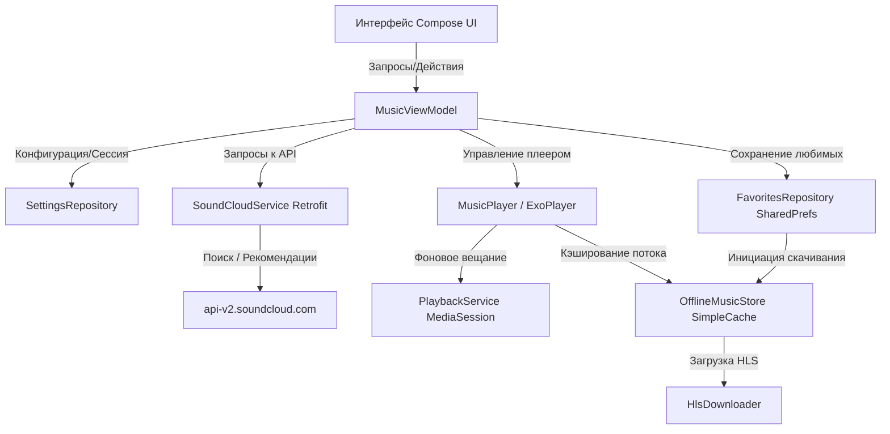

# YouCloud Music Player

Современный, премиальный и функциональный музыкальный плеер для Android на базе **Jetpack Compose** и **Media3 (ExoPlayer)**. Приложение разработано для бесшовного стриминга и полноценного офлайн-скачивания музыки с SoundCloud напрямую на устройство.

---

## 🚀 Как пользоваться приложением после установки APK

После того как вы скачали и установили APK-файл приложения на свое Android-устройство, выполните следующие шаги для начала работы:

### Шаг 1. Первая авторизация
1. При первом запуске приложения перед вами откроется фирменный экран входа SoundCloud.
2. Войдите в свой аккаунт любым удобным способом:
   * Введите логин и пароль от аккаунта SoundCloud.
   * Войдите через **Google** или **Apple**.
     > [!TIP]
     > Авторизация через Google работает полностью нативно. Всплывающее окно авторизации Google откроется поверх экрана и автоматически закроется после успешного подтверждения входа.
3. После успешного входа приложение **автоматически перехватит**:
   * Токен доступа (`OAuth Token`).
   * Публичный ключ API (`Client ID`).
   * Идентификатор вашего профиля (`User ID`).
4. Приложение автоматически закроет экран входа и загрузит главный экран с вашими персональными рекомендациями и музыкой. Больше никаких ручных копирований токенов из браузера!

### Шаг 2. Поиск и воспроизведение
* Используйте вкладку **«Поиск»** (иконка лупы), чтобы находить любые треки, плейлисты или исполнителей на SoundCloud.
* Нажмите на трек, чтобы открыть полноэкранный плеер с размытой стеклянной обложкой (эффект Glassmorphic) и элементами управления.

### Шаг 3. Сохранение музыки для прослушивания без интернета (Офлайн)
* Чтобы скачать трек, просто нажмите на иконку **«Сердечко»** (Добавить в избранное).
* Трек добавится в вашу медиатеку и автоматически начнется скачивание HLS-потока во внутреннюю память устройства.
* Все скачанные треки будут доступны на вкладке **«Скачанные»**. Они воспроизводятся напрямую из памяти устройства даже без подключения к интернету.

### Шаг 4. Управление и настройки
* **Смена аккаунта**: Если вы хотите войти под другим аккаунтом, перейдите в **«Настройки»** (шестерёнка в правом верхнем углу) и нажмите кнопку **«Войти заново»** в карточке аккаунта.
* **Эквалайзер**: Настройте звучание под свои наушники в блоке эквалайзера в настройках (можно включить/выключить и выбрать один из встроенных пресетов).
* **Смена обложки папки**: На экране «Скачанные» вы можете нажать на обложку папки и выбрать любое изображение из галереи вашего телефона, чтобы установить его в качестве обложки.

---

## 🌟 Ключевые возможности

### 1. Умная авторизация
* Полностью автоматический захват сессии из официальной формы входа SoundCloud.
* Надежная поддержка Google Sign-In с оверлейным контейнером для всплывающих окон авторизации.

### 2. Премиальный UX и Жесты (Haptic Feedback)
* **Поделиться долгим зажатием**: В плеере больше нет скучной кнопки «Поделиться». Просто **зажмите обложку трека**: сработает плотная вибрация (`EFFECT_HEAVY_CLICK`), обложка уменьшится и спружинит назад (`spring` анимация), после чего откроется системное меню отправки ссылки.
* **Тактильный таймбар**: При ручной перемотке трека пальцем по слайдеру (Seekbar) телефон воспроизводит мягкие щелчки вибрации (`EFFECT_TICK`) каждые 2% пройденного пути, делая управление физически ощутимым.
* **Умные уведомления**: Управление воспроизведением интегрировано в шторку уведомлений Android и экран блокировки. Нажатие по плееру в уведомлении мгновенно разворачивает приложение на передний план.

### 3. Воспроизведение без зависаний
* **Lazy Resolution**: Плеер лениво разрешает прямые ссылки на стриминг в фоне прямо во время воспроизведения.
* **Стабильный Shuffle**: Исправлена проблема бесконечного пропуска треков в режиме перемешивания. При включении случайного порядка плеер заранее подгружает ссылки для текущего и следующего треков, исключая задержки и ошибки ExoPlayer.

### 4. Офлайн-режим и кэширование
* **Загрузка HLS-потоков**: Скачивание треков сегментами во внутреннее зашифрованное хранилище приложения.
* **SimpleCache**: Прослушанные онлайн треки автоматически оседают в кэше ExoPlayer, экономя ваш мобильный трафик при повторном воспроизведении.

---

## ⚙️ Как это работает (Архитектура приложения)



### Основные компоненты:
1. **Retrofit SoundCloud Service**: Делает запросы к API SoundCloud, используя динамически захваченные `client_id` и `oauth_token`.
2. **Media3 PlaybackService**: Работает как `MediaSessionService` (Foreground Service), удерживая воспроизведение в памяти устройства при сворачивании приложения.
3. **OfflineMusicStore**: Управляет базой данных скачанных треков и файлами кэша ExoPlayer (`SimpleCache`), обеспечивая работу офлайн-плеера.

---

## 💻 Как собрать проект из исходников

Для сборки проекта вам понадобятся **Android Studio (Ladybug или новее)** и **JDK 17**.

1. Клонируйте репозиторий:
   ```bash
   git clone <url_репозитория>
   ```
2. Откройте проект в Android Studio.
3. Выполните сборку в терминале или через Gradle-меню:
   ```bash
   ./gradlew assembleDebug
   ```
4. APK-файл для установки будет находиться по пути:
   `app/build/outputs/apk/debug/app-debug.apk`
