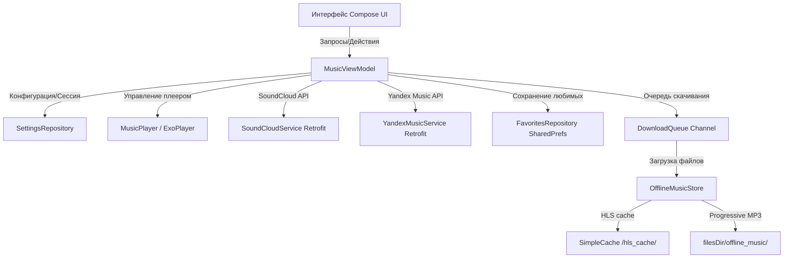

# YouCloud Music Player

Современный, премиальный и функциональный музыкальный плеер для Android на базе **Jetpack Compose** и **Media3 (ExoPlayer)**. Приложение разработано для бесшовного стриминга и полноценного офлайн-скачивания музыки напрямую на устройство из **SoundCloud** и **Яндекс.Музыки**.

---

## 🚀 Как пользоваться приложением после установки APK

После того как вы скачали и установили APK-файл приложения на свое Android-устройство, выполните следующие шаги для начала работы:

### Шаг 1. Авторизация в сервисах
1. **SoundCloud**:
   * Войдите в свой аккаунт SoundCloud при первом запуске. Приложение **автоматически перехватит** токен доступа (`OAuth Token`), API `client_id` и `user_id`. Больше никаких ручных копирований токенов из браузера!
2. **Яндекс.Музыка**:
   * Перейдите в **«Настройки»** (иконка шестерёнки в правом верхнем углу) и нажмите **«Войти через Яндекс»** (поддерживается автозаполнение и вход через Яндекс.ID). Приложение автоматически получит OAuth-токен.

### Шаг 2. Поиск и воспроизведение
* Поиск работает по обоим сервисам! Переключайте источник в верхней части вкладки **«Поиск»** (SoundCloud или Яндекс.Музыка).
* Нажмите на трек, чтобы открыть полноэкранный плеер с размытой стеклянной обложкой (эффект Glassmorphic) и монотонным анимированным фоном из плавающих фигур.

### Шаг 3. Сохранение музыки офлайн
* Чтобы скачать трек, просто нажмите на иконку **«Сердечко»** (Добавить в избранное) на карточке трека или внутри плеера.
* Для Яндекс.Музыки треки скачиваются как прогрессивные MP3-файлы, для SoundCloud — HLS-сегменты.
* Все скачанные треки будут доступны на вкладке **«Скачанные»**. Они воспроизводятся напрямую из памяти устройства даже без подключения к интернету.

### Шаг 4. Управление и настройки
* **Синхронизация лайков**: В настройках можно запустить автоматическое скачивание всех ваших лайков из SoundCloud или плейлиста «Мне нравится» из Яндекс.Музыки.
* **Перескачивание**: Если файл скачался некорректно, откройте контекстное меню трека (три точки) и выберите **«Перескачать трек»** для повторной чистой загрузки.
* **Эквалайзер**: Настройте звучание под свои наушники в блоке эквалайзера в настройках (доступен выбор встроенных пресетов).
* **Смена обложки папки**: На экране «Скачанные» вы можете изменить обложку папки, выбрав изображение из галереи вашего телефона.

---

## 🌟 Ключевые возможности

### 1. Поддержка SoundCloud и Яндекс.Музыки
* Полная интеграция: поиск, плейлисты, альбомы, страницы артистов и синхронизация лайков для обеих платформ.
* Быстрая и плавная загрузка страниц артистов с кнопкой **«Загрузить все популярные треки»** (до 100 треков).

### 2. Последовательная очередь загрузок (Sequential Download Queue)
* Все фоновые скачивания, авто-синхронизация библиотеки и перескачивания выполняются строго по очереди через однопоточный `Channel`.
* Это полностью решает проблему параллельных соединений, снижая нагрузку на сеть и исключая разрывы HTTP-соединений и недокачанные файлы.

### 3. Надежная валидация длительности
* Приложение проверяет длительность скачанных MP3-файлов через `MediaMetadataRetriever` перед сохранением.
* Если файл обрывается на середине и его длительность не совпадает с заявленной (допуск до 8 секунд или 95%), он автоматически удаляется, а трек исключается из медиатеки во избежание битых аудиозаписей.
* Если у трека отсутствует метаинформация о длительности, выполняется фоновый запрос к API для восстановления оригинального хронометража.

### 4. Динамическое перемещение путей (Path Relocation)
* Android может динамически менять абсолютный путь к внутренней папке приложения (`context.filesDir`) при перезапуске (например, из-за обновлений или смены профилей).
* Приложение автоматически перерасчитывает пути к локальным MP3-файлам на старте, гарантируя, что скачанная музыка всегда запустится и не пропадет из библиотеки.
* Кэш ExoPlayer изолирован в папку `/hls_cache/`, чтобы избежать авто-удаления прогрессивных MP3-файлов движком SimpleCache на старте приложения.

### 5. Премиальный UX и Анимации
* **Поделиться долгим зажатием**: Зажмите обложку в плеере, чтобы поделиться ссылкой с плотной тактильной отдачей (`EFFECT_HEAVY_CLICK`) и плавной `spring`-анимацией.
* **Тактильный таймбар**: Мягкие щелчки вибрации (`EFFECT_TICK`) каждые 2% ручной прокрутки трека на Seekbar.
* **Дебаг-информация**: Специальный тумблер в настройках, выводящий точный процент целостности локального файла на экране «Скачанные» (красным цветом, если `< 90%`).
* **Монотонный анимированный фон**: Живые плавающие фигуры на экране плеера и главном экране, создающие эффект глубины.

---

## ⚙️ Как это работает (Архитектура приложения)



### Основные компоненты:
1. **MusicViewModel**: Центральный оркестратор бизнес-логики, содержащий последовательную очередь скачивания (`DownloadQueue`) и управляющий воспроизведением.
2. **FavoritesRepository**: Хранит любимые треки и метаданные, динамически исправляет локальные пути при запуске приложения.
3. **OfflineMusicStore**: Управляет локальной дисковой памятью: скачивает HLS-сегменты (в `SimpleCache`) и MP3-потоки напрямую.
4. **Media3 PlaybackService**: Управляет фоновым воспроизведением и системными уведомлениями.

---

## 💻 Как собрать проект из исходников

Для сборки проекта вам понадобятся **Android Studio (Ladybug или новее)** и **JDK 17**.

1. Клонируйте репозиторий:
   ```bash
   git clone <url_репозитория>
   ```
2. Откройте проект в Android Studio.
3. Выполните сборку в терминале или через Gradle-меню:
   * **Отладочная версия**:
     ```bash
     ./gradlew assembleDebug
     ```
     (APK будет находиться в `app/build/outputs/apk/debug/app-debug.apk`)
   * **Релизная версия**:
     ```bash
     ./gradlew assembleRelease
     ```
     (APK будет находиться в `app/build/outputs/apk/release/app-release-unsigned.apk`)
