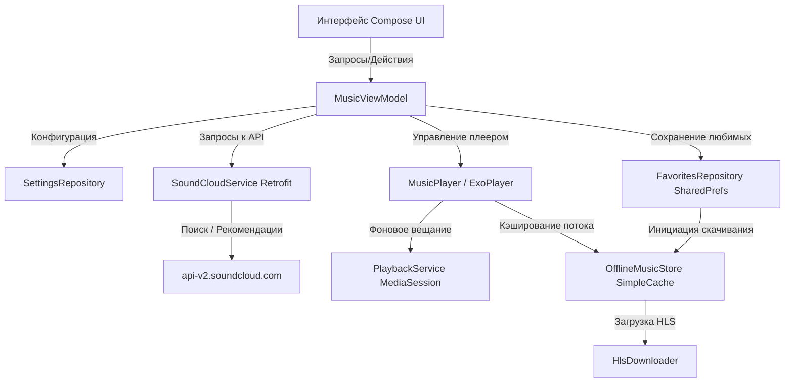

# SoundCloud Music Player

Современный и функциональный музыкальный плеер для Android на базе Jetpack Compose и Media3 (ExoPlayer), предназначенный для воспроизведения и офлайн-скачивания музыки с SoundCloud.

---

## 🛠️ Что можно настроить и ввести (Настройки приложения)

Для полноценной работы всех функций приложения в разделе **«Настройки»** (доступен по иконке шестерёнки на главном экране) или через конфигурационные файлы можно указать следующие параметры:

1. **SoundCloud Client ID (`client_id`)**
   * **Зачем нужен:** Обязательный ключ для авторизации поисковых запросов, получения списков треков, рекомендаций и ссылок на стриминг.
   * **Как задать:**
     * Через интерфейс настроек в приложении.
     * Через файл `local.properties` проекта (автоматически подставляется при сборке):
       ```properties
       soundCloud.clientId=YOUR_CLIENT_ID
       ```
2. **SoundCloud OAuth Token**
   * **Зачем нужен:** Необходим для загрузки персональных разделов («Mixed for you» и «your-moods») с SoundCloud.
   * **Как задать:** В интерфейсе настроек вставить токен из заголовка `Authorization` (без префикса `OAuth `).
3. **SoundCloud User ID**
   * **Зачем нужен:** Используется для синхронизации лайков. При добавлении трека в избранное в приложении, ему автоматически ставится лайк на вашей учётной записи SoundCloud.
4. **Обложка для папки скачанных треков**
   * **Зачем нужна:** Вы можете выбрать любое изображение со своего устройства через системный файловый менеджер (выбор документа/картинки) в качестве обложки для плейлиста «Скачанные».

---

## 🌟 Что доступно (Функционал приложения)

### 1. Интерфейс и навигация (Compose UI)
* **Главный экран (Home):**
  * Сводка «Моя музыка» и быстрый переход в настройки.
  * Блок поиска и кнопка быстрого перехода к скачанным трекам.
  * Блоки рекомендаций («Mixed for you», «your-moods», «Discover with Station»), подгружаемые с SoundCloud при наличии OAuth-токена.
* **Экран поиска (Search):**
  * Отдельный экран поиска треков по текстовому запросу с автодополнением (триггер поиска при вводе от 3-х символов).
  * Возможность мгновенно воспроизвести трек или добавить его в избранное.
* **Экран скачанных треков (Downloads):**
  * Отображает только загруженные файлы.
  * Кастомная обложка папки с возможностью её смены.
  * Удаление загруженных локально треков без снятия лайка.
* **Экран деталей микса (Mix Detail):**
  * Список треков внутри выбранного плейлиста или станции с обложкой, названиями треков и авторов.
* **Полноэкранный плеер (Track Detail):**
  * Большой дизайн с размытой обложкой на фоне (Glassmorphic-эффект).
  * Управление воспроизведением (Play/Pause, Next, Previous, Seekbar).
  * Индикаторы состояния загрузки.
  * Режимы повтора (выкл. ➔ повтор всего плейлиста ➔ повтор одного трека) и случайного воспроизведения (Shuffle).

### 2. Фоновое воспроизведение и медиасессия (Media3)
* **PlaybackService:** Служба плеера работает как Foreground Service на базе `MediaSessionService`. Музыка продолжает играть в фоне при закрытии приложения или блокировке экрана.
* **Системные Media Controls:** Полная интеграция с системным оверлеем уведомлений Android (управление с экрана блокировки, шторки уведомлений и носимых устройств).
* **Поддержка плейлистов и очередей:** Очередь воспроизведения автоматически переходит на следующий трек по окончании текущего.

### 3. Офлайн-режим и кэширование
* **Загрузка HLS-потоков:** При нажатии на «лайк» приложение добавляет трек в избранное и запускает загрузку HLS-сегментов потока во внутреннюю память телефона (`filesDir/offline_music`).
* **Экономия трафика (SimpleCache):** Воспроизведение треков использует общий кэш. Если вы слушаете трек онлайн, он автоматически сохраняется в кэш ExoPlayer, и при повторном запуске сегменты воспроизводятся локально без повторного скачивания.

### 4. Дизайн и анимации
* **Dynamic Colors (Android 12+):** Цветовая гамма приложения адаптируется под обои рабочего стола пользователя.
* **Тактильный отклик (Haptic Feedback):** Плавная вибрация при взаимодействии с элементами интерфейса (клики, удержание).
* **Микро-анимации:** Плавное появление плеера, масштабирование карточек при нажатии.

---

## ⚙️ Как это работает (Под капотом)



### Схема работы плеера:
1. **Поиск и выбор трека:**
   * Retrofit-клиент делает запрос к `api-v2.soundcloud.com/search/tracks` используя указанный `client_id`.
   * При выборе трека `SoundCloudPlaybackResolver` анализирует доступные транскодинги (форматы медиапотоков) и выбирает оптимальный стрим (предпочтительно HLS).
2. **Воспроизведение (мультиплексирование потоков):**
   * Плеер `MusicPlayer` создаёт контроллер `MediaController`, привязанный к `PlaybackService`.
   * Передаётся список `MediaItem`. Ссылка на аудиопоток разрешается "лениво" (lazy resolution) в фоне: пока играет текущий трек, приложение заранее получает прямую ссылку для следующего трека в очереди, чтобы переключение происходило без задержек.
3. **Офлайн-сохранение:**
   * Добавление трека в избранное вызывает метод в `OfflineMusicStore`.
   * `HlsDownloader` скачивает HLS-плейлист (`.m3u8`) и сегменты (`.ts`), записывая их в `SimpleCache` (база данных ExoPlayer StandaloneDatabaseProvider).
   * При воспроизведении `DefaultMediaSourceFactory` оборачивается в `CacheDataSource`, который сначала ищет нужные сегменты в локальном хранилище, и только при их отсутствии скачивает из сети.
