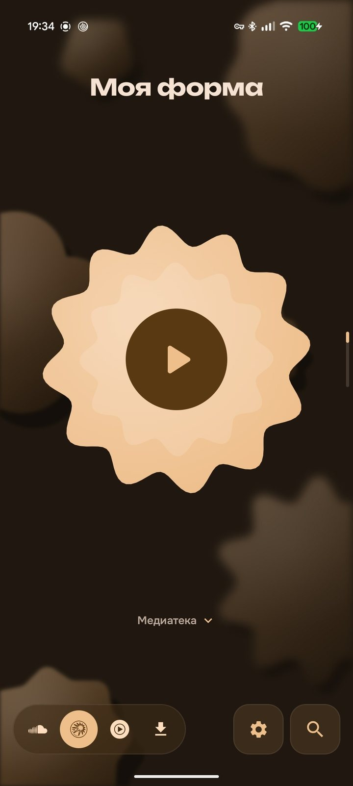
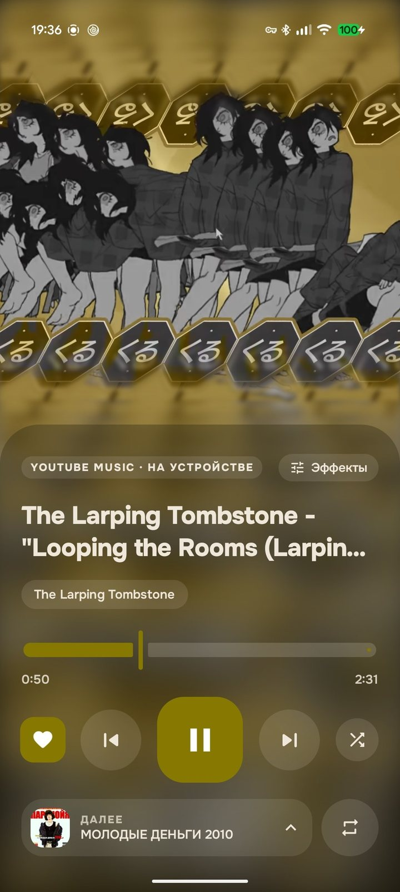
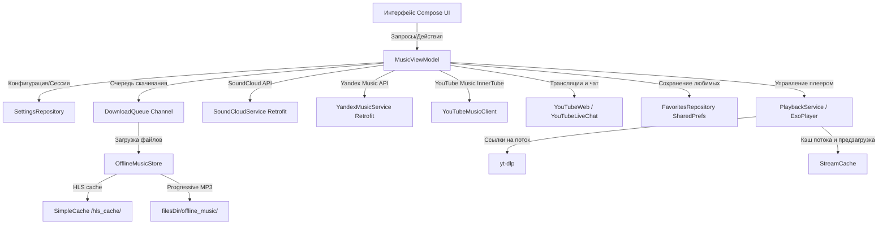

# YouCloud Music Player

Музыкальный плеер для Android на **Jetpack Compose** и **Media3 (ExoPlayer)** в стиле **Material 3 Expressive**. Слушает и скачивает музыку из **SoundCloud**, **Яндекс Музыки** и **YouTube Music**: клипы, прямые трансляции с чатом, «Моя волна» Яндекса, подписки на артистов и офлайн-медиатека в одном приложении.

---

## 📸 Скриншоты

<table>
  <tr>
    <td></td>
    <td></td>
    <td></td>
    <td></td>
  </tr>
  <tr>
    <td align="center">Главная</td>
    <td align="center">Моя форма</td>
    <td align="center">Плеер</td>
    <td align="center">Трек с клипом</td>
  </tr>
  <tr>
    <td></td>
    <td></td>
    <td></td>
    <td></td>
  </tr>
  <tr>
    <td align="center">Скачанное</td>
    <td align="center">Альбом</td>
    <td align="center">Поиск</td>
    <td align="center">Артист и трансляции</td>
  </tr>
  <tr>
    <td></td>
    <td></td>
    <td colspan="2"></td>
  </tr>
  <tr>
    <td align="center">Трансляция</td>
    <td align="center">Чат трансляции</td>
    <td colspan="2"></td>
  </tr>
</table>

### В горизонтальном режиме

<table>
  <tr>
    <td></td>
    <td></td>
  </tr>
  <tr>
    <td></td>
    <td></td>
  </tr>
  <tr>
    <td colspan="2" align="center"></td>
  </tr>
</table>

---

## 🚀 Как пользоваться приложением после установки APK

Скачайте `YouCloud.X.Y.apk` со страницы [Releases](https://github.com/GXUser7/YouCloud/releases) и установите. Дальше приложение обновляется само.

### Шаг 1. Авторизация в сервисах
1. **SoundCloud**: войдите в аккаунт при первом запуске. Приложение **само перехватит** токен доступа (`OAuth Token`), `client_id` и `user_id` — копировать ничего не нужно.
2. **Яндекс Музыка**: **Настройки → Аккаунты → Войти** (вход через Яндекс ID). Токен приложение получит само.
3. **YouTube Music**: **Настройки → Аккаунты → YouTube Music → Войти**. Нужен для подборок, клипов, лайков, подписок и чата трансляций.

### Шаг 2. Поиск и воспроизведение
* Поиск идёт по всем подключённым сервисам сразу: строка поиска и переключатель сервисов внизу экрана, между сервисами можно листать свайпом.
* На главной у каждого сервиса свои разделы: миксы и станции SoundCloud, «Моя форма» и подборки Яндекса, подборки YouTube Music, «Моя музыка» с медиатекой.
* Нажмите на трек, чтобы открыть плеер. Название трека в плеере открывает его альбом (Яндекс Музыка, YouTube Music), таблетки артистов — их страницы. Свайп вниз сворачивает плеер в мини-плеер, свайп вверх открывает очередь.

### Шаг 3. Сохранение музыки офлайн
* Сердечко на треке добавляет его в «Скачанное» и скачивает на устройство; для YouTube Music лайк уходит и в ваш аккаунт.
* Треки и клипы из памяти телефона можно добавить в «Скачанное» кнопкой импорта.
* Скачанное играет без интернета.

### Шаг 4. Управление и настройки
* **Синхронизация лайков**: автоматическое скачивание лайков SoundCloud и «Мне нравится» Яндекс Музыки.
* **Перескачивание**: зажмите обложку в плеере и выберите **«Перескачать»**.
* **Эффекты трека**: реверб, замедление и ускорение — свои для каждого трека (**Настройки → Звук → Эффекты в плеере**).
* **Эквалайзер** со встроенными пресетами.
* **Подсветка**: свет клипа или обложки заполняет фон плеера — Ambilight или прежние размытые копии, отдельно для клипов и обложек.
* **Страницы авторов YouTube**: треки, альбомы и трансляции, а с переключателем «Вся страница автора YouTube» — все ряды канала.
* **Обновления**: приложение проверяет релизы на GitHub раз в 12 часов и само предлагает установить новую версию (**Настройки → Обновления**).

---

## 🌟 Ключевые возможности

### 1. Три сервиса в одном плеере
* **SoundCloud, Яндекс Музыка, YouTube Music**: поиск, плейлисты, альбомы, страницы артистов, лайки.
* **Подписки на артистов** во всех трёх сервисах прямо со страницы артиста.
* **Клипы**: клип трека играет вместо обложки, на весь экран в горизонтальном режиме — с перемоткой и кнопками как на YouTube.
* **«Моя форма»** — «Моя волна» Яндекс Музыки с настроениями и режимами, лайками и «Не нравится», которые учитывает радио.
* **Радио от трека** в Яндекс Музыке и YouTube Music продолжает играть трек с того места, где он был.

### 2. Прямые трансляции
* Эфиры YouTube отмечены в поиске, на страницах каналов есть ряд «Трансляции».
* **Чат трансляции** на месте текста песни: эмодзи картинками, отправка сообщений, точная причина, если писать нельзя, и подписка на канал в один тап.

### 3. Горизонтальный режим
* Каждый экран разложен под альбомную ориентацию: контент слева, управление и мини-плеер справа — под большим пальцем.

### 4. Кэш и предзагрузка
* Прослушанные треки остаются в кэше потока (до 400 МБ), следующие два трека очереди загружаются заранее.
* Оборвавшийся поток переподключается сам.

### 5. Последовательная очередь загрузок
* Все скачивания, синхронизация и перескачивания идут по очереди через однопоточный `Channel` — без параллельных соединений и недокачанных файлов.

### 6. Надёжная валидация длительности
* Длительность скачанных MP3 проверяется через `MediaMetadataRetriever`; оборванный файл удаляется, а трек не попадает в медиатеку битым.

### 7. Material 3 Expressive
* Главная — обложка по центру, соседи сжимаются в полоски; сервисы в плавающей панели.
* **Живой фон**: фигуры реагируют на наклон и тряску телефона.
* **Цвета плеера из обложки** в тёмной и светлой теме.
* Шрифты **Unbounded** для заголовков и **Onest** для текста.
* Лёгкий режим для слабых телефонов: сборка через R8, эффекты подобраны по нагрузке на GPU.

---

## ⚙️ Как это работает (Архитектура приложения)


```mermaid
graph TD
    UI[Интерфейс Compose UI] -->|Запросы/Действия| VM[MusicViewModel]
    VM -->|Конфигурация/Сессия| Settings[SettingsRepository]
    VM -->|Управление плеером| Player[PlaybackService / ExoPlayer]
    VM -->|SoundCloud API| SC_Service[SoundCloudService Retrofit]
    VM -->|Yandex Music API| YM_Service[YandexMusicService Retrofit]
    VM -->|YouTube Music InnerTube| YTM[YouTubeMusicClient]
    VM -->|Трансляции и чат| YTW[YouTubeWeb / YouTubeLiveChat]
    VM -->|Сохранение любимых| Favs[FavoritesRepository SharedPrefs]

    VM -->|Очередь скачивания| Queue[DownloadQueue Channel]
    Queue -->|Загрузка файлов| Store[OfflineMusicStore]

    Player -->|Ссылки на поток| YtDlp[yt-dlp]
    Player -->|Кэш потока и предзагрузка| Cache[StreamCache]
    Store -->|HLS cache| SimpleCache[SimpleCache /hls_cache/]
    Store -->|Progressive MP3| filesDir[filesDir/offline_music/]
```

### Основные компоненты:
1. **MusicViewModel**: оркестратор бизнес-логики, очередь скачивания (`DownloadQueue`) и управление воспроизведением.
2. **PlaybackService**: фоновое воспроизведение, уведомление, Android Auto, эффекты трека (реверб считается внутри плеера).
3. **YouTubeMusicClient / YouTubeWeb**: подборки, поиск, артисты, альбомы, трансляции и чат YouTube.
4. **StreamCache / StreamPrefetcher**: кэш потока и загрузка следующих треков заранее.
5. **OfflineMusicStore**: скачанные треки — HLS-сегменты в `SimpleCache` и MP3-файлы.
6. **FavoritesRepository**: любимые треки и метаданные, исправление путей к файлам при запуске.

---

## 💻 Как собрать проект из исходников

Понадобятся **Android Studio (Ladybug или новее)** и **JDK 17**.

1. Клонируйте репозиторий:
   ```bash
   git clone https://github.com/GXUser7/YouCloud.git
   ```
2. Откройте проект в Android Studio.
3. Соберите:
   * **Отладочная версия**:
     ```bash
     ./gradlew assembleDebug
     ```
   * **Релизная версия**:
     ```bash
     ./gradlew assembleRelease
     ```
     APK появится в `app/build/outputs/apk/release/` под именем `YouCloud.X.Y.apk`. Подпись берётся из ключей `youcloud.*` в `local.properties`.
