<div align="center">


# YouCloud

**SoundCloud, Яндекс Музыка и YouTube Music в одном плеере для Android.**

Клипы и прямые эфиры, «Моя волна», офлайн-медиатека, друзья и музыка вместе —<br>в матовом Material 3 Expressive, где всё под большим пальцем.

<br>

[](https://github.com/GXUser7/YouCloud/releases/latest)
[](https://github.com/GXUser7/YouCloud/releases)
[](#установка)
[](#как-устроено)
[](#как-устроено)
[](#как-устроено)

<br>

### [Скачать последнюю версию](https://github.com/GXUser7/YouCloud/releases/latest)

[Возможности](#возможности) &nbsp;·&nbsp; [Горизонтальный режим](#горизонтальный-режим) &nbsp;·&nbsp; [Установка](#установка) &nbsp;·&nbsp; [Как устроено](#как-устроено) &nbsp;·&nbsp; [Сборка](#сборка-из-исходников)

<br>

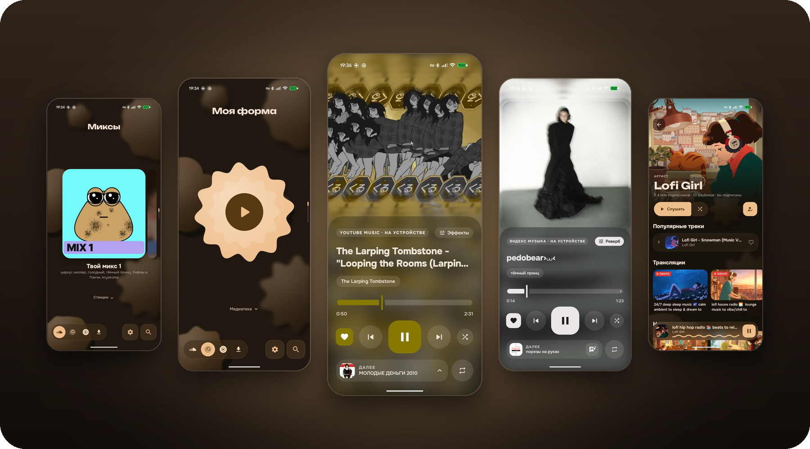

</div>

<br>

## Почему YouCloud

<table>
  <tr>
    <td width="33%" valign="top">
      <h3>Три сервиса — одна медиатека</h3>
      Поиск сразу по SoundCloud, Яндексу и YouTube Music. Лайки, плейлисты и подписки всех трёх в одном месте, а скачанное играет без сети.
    </td>
    <td width="33%" valign="top">
      <h3>Под большим пальцем</h3>
      Наверху ничего нет: сервисы, поиск, меню и мини-плеер — внизу экрана. Окна закрываются свайпом вниз, как плеер, а не кнопкой «назад».
    </td>
    <td width="33%" valign="top">
      <h3>Музыка вместе</h3>
      Слушайте одно и то же с друзьями рядом — телефоны сверяют часы и играют вровень. А друзья по нику видят, кто что слушает прямо сейчас.
    </td>
  </tr>
</table>

<br>

## Возможности

<table>
  <tr>
    <td width="62%" valign="middle">

### Музыка из трёх сервисов

- **Поиск по всем сервисам сразу** — переключатель внизу экрана, между сервисами листается свайпом.
- **У каждого сервиса своя главная:** миксы и станции SoundCloud, «Моя форма» и подборки Яндекса, подборки YouTube Music с «Понравившейся музыкой» в самом начале, «Моя музыка» с медиатекой.
- **«Моя форма»** — «Моя волна» Яндекса живой фигурой на главной: зажмите её, чтобы выбрать настроение и режим. «Нравится» и «Не нравится» учитывает радио.
- **Музыка не кончается:** радио от любого трека в Яндексе и YouTube Music, похожие треки SoundCloud — закончился альбом или плейлист, дальше играет радио.
- **Подписки на артистов** во всех трёх сервисах и страницы авторов YouTube целиком — с альбомами и трансляциями.
- **Ссылки открываются в YouCloud:** трек, альбом, плейлист или артист любого сервиса — из «Поделиться», Telegram или браузера.

</td>
    <td width="38%" align="center">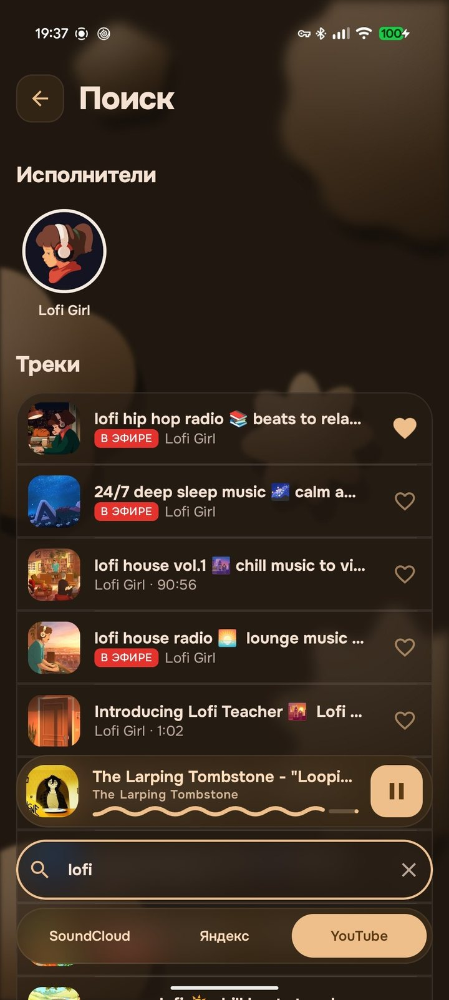</td>
  </tr>
</table>

<table>
  <tr>
    <td width="38%" align="center">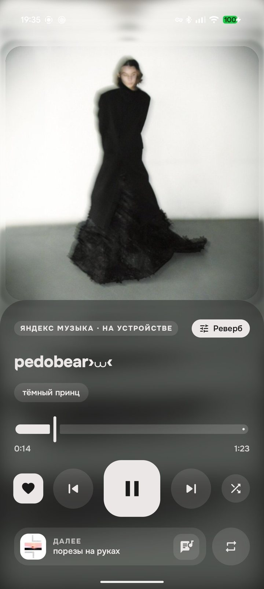</td>
    <td width="62%" valign="middle">

### Плеер

- **Цвета из обложки** в тёмной и светлой теме, а **подсветка в стиле Ambilight** заливает фон светом клипа или обложки.
- **Эффекты трека:** реверб, замедление и ускорение — свои для каждого трека. **Эквалайзер** с пресетами.
- **Кроссфейд** на 3, 5, 8 или 12 секунд: следующий трек плавно приходит на смену, ничего не проваливается и не звучит дважды.
- **Таймер сна** на 15–90 минут или до конца трека, с плавным затуханием.
- **Синхронные тексты песен** — от Яндекса и из открытой библиотеки LRCLIB.
- **Жесты:** вниз — свернуть в мини-плеер, вверх — очередь, вбок по обложке или мини-плееру — соседний трек. Долгое нажатие на обложку открывает меню трека: плейлисты, «Поделиться», радио, «Вместе», таймер и кроссфейд.

</td>
  </tr>
</table>

<table>
  <tr>
    <td width="62%" valign="middle">

### Клипы и прямые эфиры

- **Клип играет вместо обложки**, а в горизонтальном режиме — на весь экран, с перемоткой как на YouTube. Формат подбирается под телефон: VP9 там, где его тянет железо, иначе H.264.
- **Эфиры YouTube** отмечены в поиске, на страницах каналов есть ряд «Трансляции».
- **Чат трансляции** на месте текста песни: эмодзи картинками, отправка сообщений, подписка на канал в одно касание.

</td>
    <td width="38%" align="center">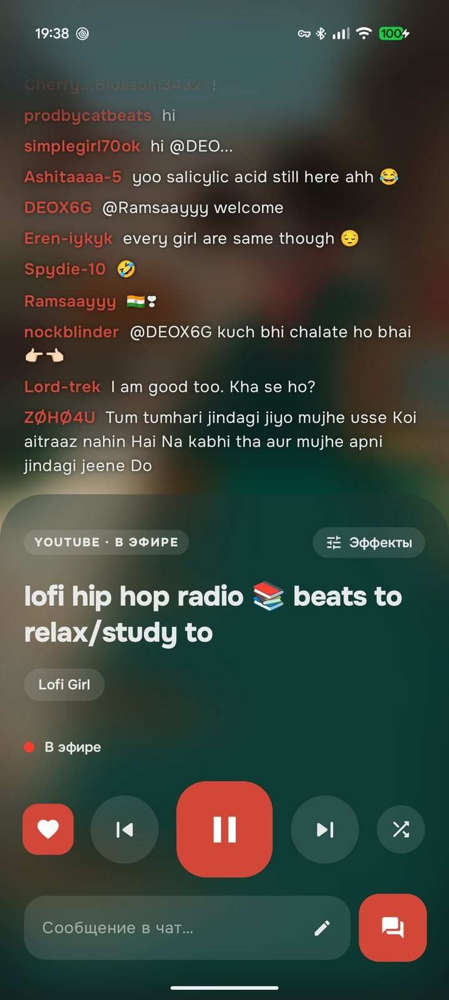</td>
  </tr>
</table>

<table>
  <tr>
    <td width="38%" align="center">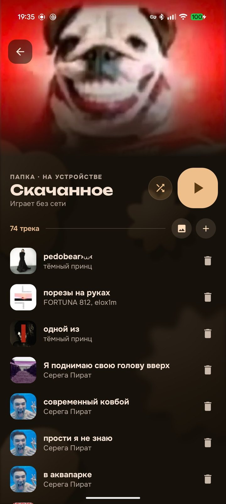</td>
    <td width="62%" valign="middle">

### Музыка офлайн

- **Сердечко скачивает трек** в «Скачанное», новые — сверху. Лайк в YouTube Music уходит и в аккаунт.
- **Синхронизация лайков:** лайки SoundCloud и «Мне нравится» Яндекса скачиваются сами.
- **Импорт** треков и клипов из памяти телефона.
- **История** последних 200 треков, выбор нескольких треков и удаление одной кнопкой.
- **Без пауз между треками:** кэш потока до 400 МБ и предзагрузка двух следующих треков; оборвавшийся поток переподключается сам.
- **Ничего битого:** скачивания идут строго по очереди, а длительность каждого файла проверяется.

</td>
  </tr>
</table>

### Слушать вместе

- Друзья рядом слушают одну музыку, каждый со своего телефона. Телефоны соединяются **напрямую по Bluetooth и Wi-Fi** — интернет между ними не нужен.
- YouCloud **сверяет часы телефонов** и незаметно подгоняет отстающий; новый трек стартует у всех одновременно.
- **Музыку выбирают все:** кнопки и треки гостя управляют общим плеером. Трек Яндекса играет у гостя даже без подписки.
- Задержка Bluetooth-наушников поправляется ползунком.

### Друзья и профиль

- **Аккаунт по нику и паролю**, без почты, с кодом восстановления.
- **Что друзья слушают прямо сейчас** — обновляется в реальном времени. «Включить у себя» ставит тот же трек.
- **Витрина профиля:** любимый исполнитель, трек и альбом из любого сервиса.
- **Меню на аватаре:** зажмите аватар, проведите до пункта и отпустите — друзья, профиль и настройки одним движением.
- Не хотите делиться музыкой — «Показывать, что я слушаю» выключается одним переключателем.

### За пределами приложения

- **Виджеты** в формах Material 3 Expressive и цветах обоев — от 2×1 до 4×2, с кнопкой «Моя волна».
- «Нравится» и «Не нравится» в уведомлении, на экране блокировки и в **Android Auto**.
- Ярлыки на иконке приложения и плитка «Моя волна» в быстрых настройках.
- **Итоги прослушиваний:** минуты музыки, любимые артисты и треки, время суток — за неделю, месяц, год или всё время, с карточкой для сторис.

### Оформление

- **Матовое стекло Material 3 Expressive** и живой фон: фигуры отзываются на наклон и тряску телефона.
- Шрифты **Unbounded** и **Onest**; тема системная, светлая или тёмная; русский и English.
- **[Горизонтальный режим](#горизонтальный-режим)** на каждом экране: контент слева, управление и мини-плеер справа.
- Плавность 120 Гц, лёгкий режим для слабых телефонов и обучение жестам при первом запуске.
- **Обновления приходят сами:** приложение проверяет релизы на GitHub и предлагает установить новую версию.

<br>

## Горизонтальный режим

Каждый экран разложен под альбомную ориентацию: контент слева, управление и мини-плеер справа — под большим пальцем.

<table>
  <tr>
    <td align="center">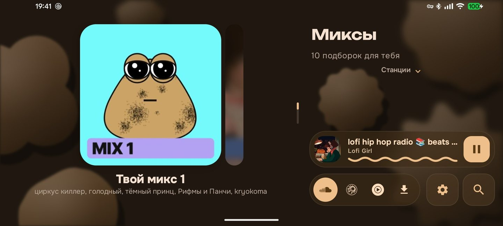<br><sub>Главная</sub></td>
    <td align="center">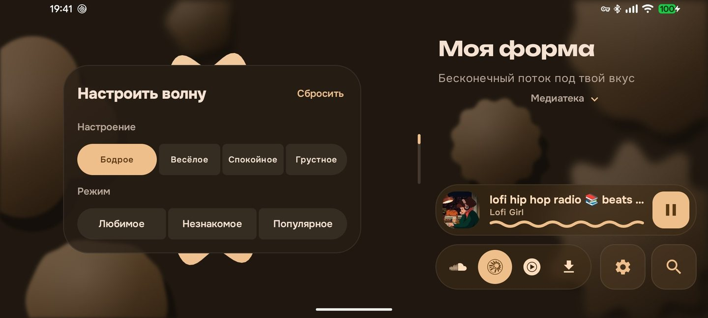<br><sub>Моя форма и настройка волны</sub></td>
  </tr>
  <tr>
    <td align="center">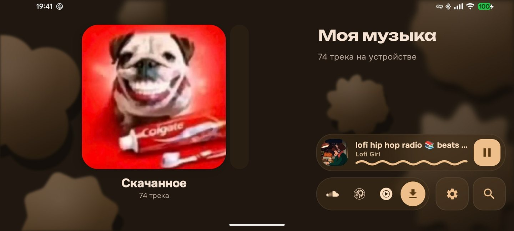<br><sub>Моя музыка</sub></td>
    <td align="center">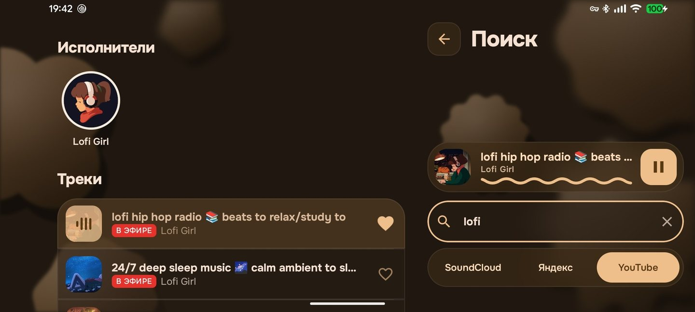<br><sub>Поиск</sub></td>
  </tr>
  <tr>
    <td colspan="2" align="center">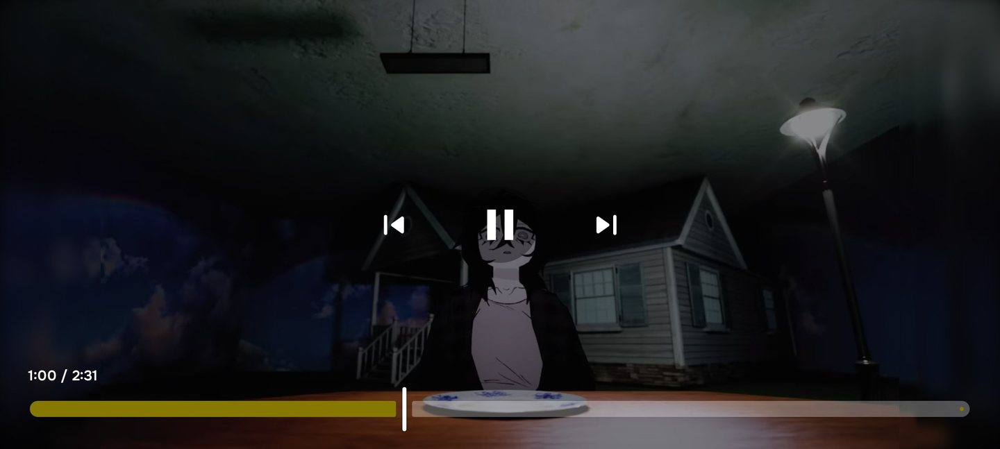<br><sub>Клип на весь экран</sub></td>
  </tr>
</table>

<details>
<summary><b>Ещё экраны</b></summary>
<br>
<table>
  <tr>
    <td align="center">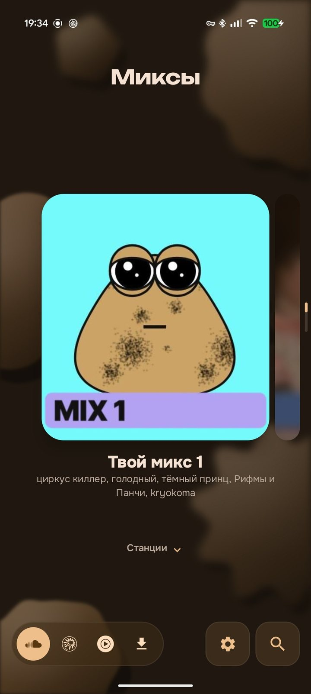<br><sub>Миксы SoundCloud</sub></td>
    <td align="center">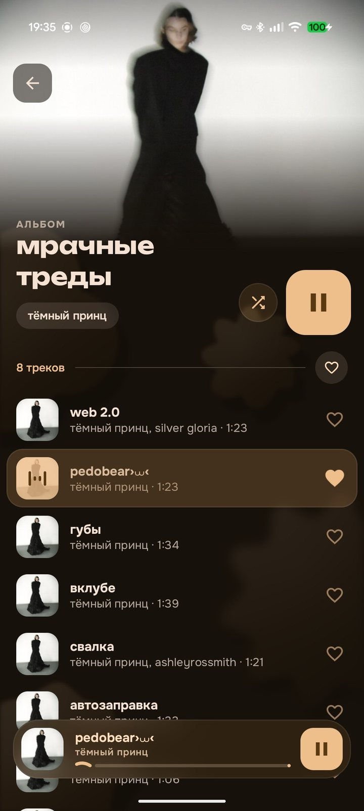<br><sub>Альбом</sub></td>
    <td align="center">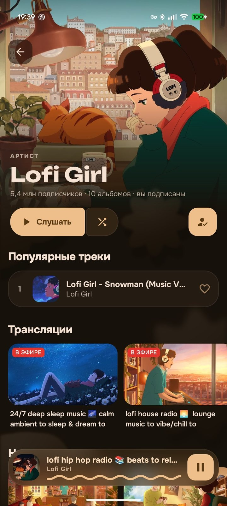<br><sub>Артист и трансляции</sub></td>
    <td align="center">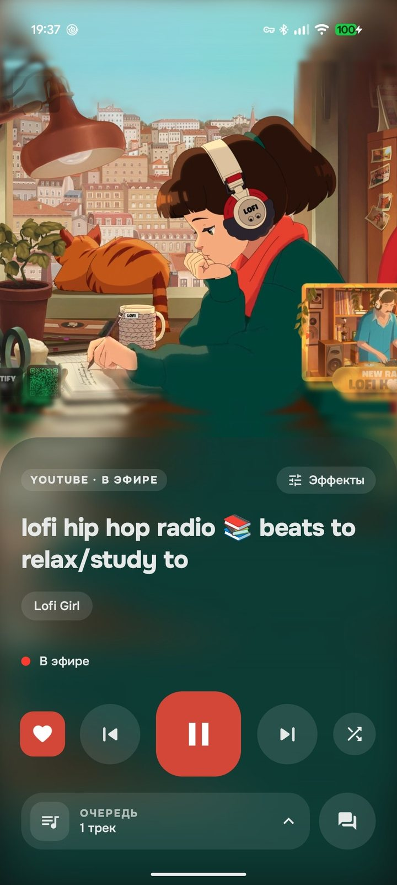<br><sub>Прямой эфир</sub></td>
  </tr>
</table>
</details>

<br>

## Установка

1. Скачайте `YouCloud.X.Y.apk` из [последнего релиза](https://github.com/GXUser7/YouCloud/releases/latest) и установите. Нужен Android 14 или новее и 64-битный процессор (arm64-v8a).
2. Войдите в сервисы, которыми пользуетесь. Токены и ключи приложение берёт само — копировать ничего не нужно.

| Сервис | Где войти | Что это даёт |
| --- | --- | --- |
| **SoundCloud** | при первом запуске | миксы, станции, лайки, плейлисты, подписки |
| **Яндекс Музыка** | Настройки → Аккаунты → Войти через Яндекс ID | «Моя волна», подборки, «Мне нравится», радио |
| **YouTube Music** | Настройки → Аккаунты → YouTube Music | подборки, клипы, лайки, подписки, чат эфиров |
| **YouCloud** | аватар на главной → Профиль | друзья, витрина, что слушают друзья |

3. Дальше YouCloud обновляется сам: раз в 12 часов он проверяет релизы на GitHub и предлагает поставить новую версию.

<br>

## Как устроено

| | |
| --- | --- |
| **Язык и интерфейс** | Kotlin, Jetpack Compose, Material 3 Expressive |
| **Воспроизведение** | Media3 ExoPlayer в `MediaLibraryService`: фон, уведомление, Android Auto. Свой реверб в аудиоцепочке, второй плеер для кроссфейда |
| **Сервисы** | SoundCloud API и Яндекс Музыка API через Retrofit и OkHttp, YouTube Music InnerTube, yt-dlp для потоков и клипов |
| **Офлайн** | `SimpleCache` для HLS и кэша потока, MP3 в памяти приложения |
| **Вместе** | Google Nearby Connections и синхронизация часов телефонов |
| **Друзья** | Supabase: Auth, PostgREST с правилами доступа к строкам, Realtime |
| **Виджеты** | Jetpack Glance |
| **Тексты песен** | Яндекс Музыка и LRCLIB |

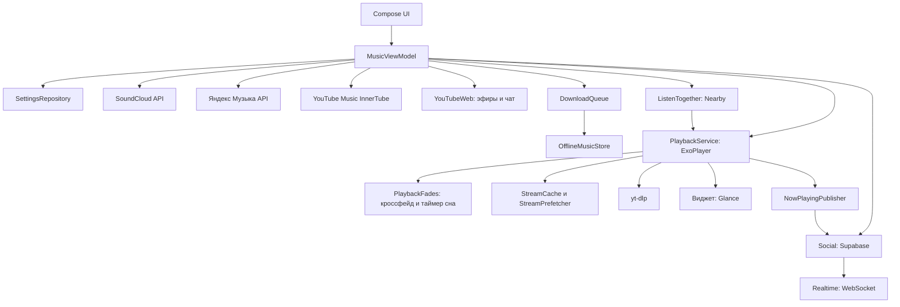
```mermaid
graph TD
    UI[Compose UI] --> VM[MusicViewModel]
    VM --> Settings[SettingsRepository]
    VM --> SC[SoundCloud API]
    VM --> YM[Яндекс Музыка API]
    VM --> YTM[YouTube Music InnerTube]
    VM --> YTW[YouTubeWeb: эфиры и чат]
    VM --> Queue[DownloadQueue]
    Queue --> Store[OfflineMusicStore]
    VM --> Together[ListenTogether: Nearby]
    VM --> Social[Social: Supabase]
    Social --> Realtime[Realtime: WebSocket]

    VM --> Player[PlaybackService: ExoPlayer]
    Together --> Player
    Player --> Fades[PlaybackFades: кроссфейд и таймер сна]
    Player --> Cache[StreamCache и StreamPrefetcher]
    Player --> YtDlp[yt-dlp]
    Player --> Widget[Виджет: Glance]
    Player --> NowPlaying[NowPlayingPublisher]
    NowPlaying --> Social
```

- **MusicViewModel** — вся логика экранов: поиск, медиатека, очередь скачиваний и управление плеером.
- **PlaybackService** — фоновое воспроизведение, уведомление, Android Auto, эффекты трека и эквалайзер.
- **PlaybackFades** — кроссфейд: старый трек доигрывает до конца, следующий начинает второй плеер, а потом основной незаметно занимает его место с точностью до миллисекунд.
- **StreamCache / StreamPrefetcher** — кэш потока и загрузка следующих треков заранее.
- **OfflineMusicStore / FavoritesRepository** — скачанные треки и их метаданные.
- **ListenTogether** — сессия «Вместе»: соединение, сверка часов и общий плеер.
- **Social / Realtime** — аккаунты, друзья и витрина; изменения приходят по WebSocket, пока открыт экран с друзьями.
- **NowPlayingWidget / WidgetRenderer** — виджет перерисовывается ровно один раз на каждое изменение.

<br>

## Сборка из исходников

Понадобятся **JDK 21** и **Android SDK 35** — подойдёт свежая Android Studio.

```bash
git clone https://github.com/GXUser7/YouCloud.git
cd YouCloud
./gradlew assembleDebug
```

Релизная версия собирается командой `./gradlew assembleRelease` и появляется в `app/build/outputs/apk/release/YouCloud.X.Y.apk`. Подпись берётся из `local.properties`, без неё сборка подписывается отладочным ключом:

```properties
youcloud.storeFile=/путь/к/keystore.jks
youcloud.storePassword=...
youcloud.keyAlias=...
youcloud.keyPassword=...
```

Друзья работают на Supabase. Чтобы поднять свой бэкенд, примените миграции из `supabase/migrations`, задеплойте функцию `supabase/functions/recover` и укажите адрес и публичный ключ проекта в `local.properties` как `supabase.url` и `supabase.key`.

<br>

---

<sub>Шрифты Unbounded и Onest распространяются по SIL Open Font License, тексты лицензий лежат в <code>licenses/</code>. YouCloud — неофициальный клиент и не связан с SoundCloud, Яндексом, YouTube или Google; названия сервисов и товарные знаки принадлежат их владельцам.</sub>
